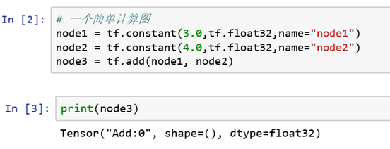

# 3.4  TensorFlow计算模型 – 数据流图

**3.4.1 数据流图的概念**

数据流图（如图3所示）是一个有向图，由以下内容构成：

•        一组节点，每个节点都代表一个操作，是一种运算

•        一组有向边，每条边代表节点之间的关系（数据传递和控制依赖）

TensorFlow有两种边：

•        常规边（实线）：代表数据依赖关系。一个节点的运算输出成为另一个节点的输入，两个节点之间有tensor流动（值传递）

•        特殊边（虚线）：不携带值，表示两个节点之间的控制相关性。比如，happens-before关系，源节点必须在目的节点执行前完成执行


**3.4.2 数据流图的实例**



可以从图4看出，打印输出的结果不是一个具体的数字，而是一个**张量的结构**。

**3.4.3 数据流图的执行**


图5承接图4，可以看出，TensorFlow的计算过程首先创建一个**静态的计算模型**，然后执行对话才将数据输入获得结果。（注：TensorFlow 1.7之后的版本提供了Eager Execution的功能，可以实现动态图的编程。）

## &gt; 示例代码 <a id="shi-li-dai-ma"></a>



```python
# 一个简单计算图
node1 = tf.constant(3.0,tf.float32,name="node1")
node2 = tf.constant(4.0,tf.float32,name="node2")
node3 = tf.add(node1, node2)
print(node3)

# 建立对话并显示运行结果
sess = tf.Session()

print("运行sess.run(node1)的结果：", sess.run(node1))
# 更新变量并返回计算结果
print("运行sess.run(node3)的结果：", sess.run(node3))

# 关闭session
sess.close()
```



