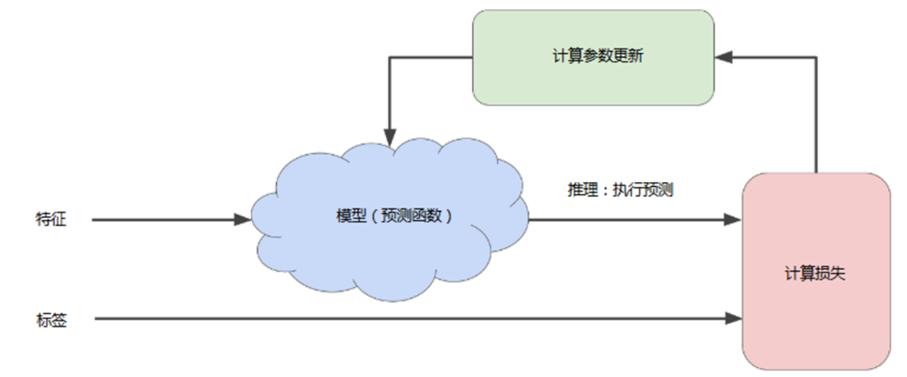

# 4.4 模型训练与降低损失

#### **4.4.1 训练模型的迭代方法**

首先我们先对模型的中的权重w和偏差b进行猜测，然后将特征点输入，执行预测和推理（Inference），将计算出的值和该样本的标签值进行对比，计算出损失值，我们的目标是使推理的值和标签值的差距越小越好，也就是损失的值越小越好，所以需要不断对计算参数进行更新，直到损失值尽可能地最低为止。

#### 4.4.2 收敛

在学习优化过程中，机器学习系统将根据所有标签去重新评估所有特征，为损失函数生成一个新值，而该值又产生新的参数值。

通常，您可以不断迭代，直到总体损失不再变化或至少变化极其缓慢为止。这时候，我们可以说该模型已收敛

#### 4.4.3 计算损失的例子

如图4-5为线性回归计算损失的例子，图中给出了预测值的计算方法和均方误差的定义。

易知该线性回归问题产生的损失与权重的关系图为凸形，如图4-6所示。

那么如何减少损失呢，让我们来看看下一节的内容。

