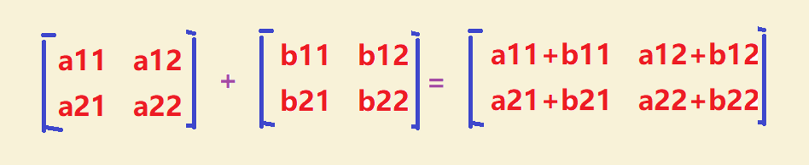

# 4.2 基本术语

#### 4.2.1 标签和特征

标签一般指的是我们要预测的真实事务，在图3中，我们用y坐标的值进行表示。

特征是指用于描述数据的输入变量，一般使用{x1,x2,…,xn}进行表示，在图3所示的线性回归问题中只有一个x轴。

#### 4.2.2 样本和模型

样本是指数据的特定实例：x ，有标签样本具有{特征，标签}：{x，y}，被用于训练模型；无标签样本具有{特征，？}：{x，?}，用于对新数据做出预测。

模型可将样本映射到预测标签：y’，由模型的内部参数定义，这些内部参数值是通过学习得到的。

**4.2.3 训练（学习）**

训练模型表示通过有标签样本来学习（确定）所有权重和偏差的理想值，在监督式学习中，机器学习算法通过以下方式构建模型： 检查多个样本并尝试找出可最大限度地减少损失的模型， 这一过程称为经验风险最小化。

#### 4.2.4 损失

损失是对糟糕预测的惩罚，损失是一个数值，表示对于单个样本而言模型预测的准确程度。

如果模型的预测完全准确，则损失为零，否则损失会较大。

训练模型的目标是从所有样本中找到一组平均损失“较小”的权重（w）和偏差（b）。

