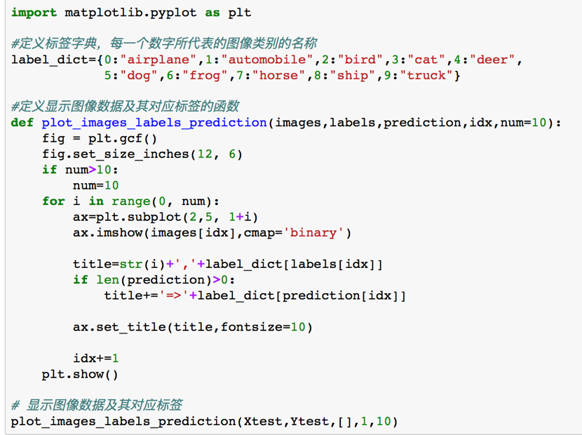

# 8.4 CIFAR-10图像识别案例的TensorFlow实现

在这一讲中，我们将一起来完成一个案例，这个案例是使用卷积神经网络对CIFAR-10数据集进行图像分类。


### **&gt; CIFAR-10数据集**

CIFAR-10是由Alex Krizhevsky, Vinod Nair和Geoffrey Hinton收集而来的用于图像识别的数据集，它一共有十个分类，每个分类有6000张32×32大小的彩色图像，所以一共有60000张图像，其中50000张用于训练，10000张用于测试。


我们可以在下面这个网址查看有关CIFAR-10数据集的介绍：

[https://www.cs.toronoto.edu/~kriz/cifar.html](https://www.cs.toronoto.edu/~kriz/cifar.html)


那么这个CIFAR-10数据集跟MNIST数据集相比有什么不同呢？

CIFAR-10是RGB三通道图像，MNIST数据集是灰度图；CIFAR-10的图像尺寸为32×32，MNIST数据集为28×28；CIFAR-10数据集它的色彩和噪点比较多，同一个分类，比如说，在卡车这个分类里，卡车的角度、颜色和大小都不一样，所以CIFAR-10图像识别难度比MNIST数据集要高得多。


### &gt; 下载CIFAR-10数据集


第一次执行上图程序的时候，程序会检查你是否已经下载过CIFAR-10数据集，如果它没有找到这个文件的话，就会自动下载文件并进行解压；如果已经下载，它会显示提示信息“Data file already exists.”、“Directory already exists.”。


CIFAR 10数据集文件的大小为163M。

如果你的网络网速不是很快，在后面通过代码下载可能会超时。如果遇到这种情况，可以先直接通过以下网址下载：

[https://www.cs.toronto.edu/~kriz/cifar-10-python.tar.gz](https://www.cs.toronto.edu/~kriz/cifar-10-python.tar.gz)

下载的文件名是cifar-10-python.tar.gz，该先在Jupty代码目录下建立data子目录，然后把下载的数据文件放到data目录。


### &gt; 导入CIFAR-10数据集

在下载和解压之后，我们需要读取训练数据和测试数据。

在这里，我们定义了两个函数：load\_CIFAR\_batch\( \)和load\_CIFAR\_data\( \)。

load\_CIFAR\_batch\( \)读取一个批次的样本，load\_CIFAR\_data\( \)实现数据集的完整读取。


我们每次读取10000条数据，所以load\_CIFAR\_data\( \)通过一个for循环语句来循环地调用load\_CIFAR\_batch\( \)，从而获取完整的数据集，最后返回的是训练集的图像和标签以及测试集的图像和标签。

运行之后，我们可以看到data已经loading完毕啦。


### &gt; 显示数据集信息

我们运用了“.shape”方法来查看训练集和测试集的信息。


训练集有50000条数据，测试集有10000条数据，图像的尺寸为32×32，通道为RGB三通道。


### &gt; 查看单项image和label

首先，我们导入matplotlib，查看一下里面的第七个样本（因为下标从0开始，所以6代表第七个样本）。


我们可以看到，上图中显示了CIFAR-10数据集中的第七个样本（一个模糊的孔雀）。我们还可以查看它的标签，标签值为2，这个2对应的就是第三类，也就是bird类。

具体信息可以在网站[http://www.cs.toronto.edu/~kriz/cifar.html](http://www.cs.toronto.edu/~kriz/cifar.html)上查看。


### &gt; 查看多项images和label

当然，我们也可以一次查看多张图像及其标签：



首先，我们需要定义一个标签字典，每一个数字代表了对应图像类别的名称。然后，我们定义了一个显示图像数据及其对应标签的函数。这里的输入参数有图像（我们需要分类的）、标签（实际上的类别）、预测的类别，num是我们一次想要展示的图片数量，在这里是10张。

运行之后就会得到下图的结果：


这里我们指定的是看前十张图片，图片上方的0是第一张图片，1是第二张图片，数字右边的单词是它们所对应的真正类别，由于我们的输入需要labels和prediction，但是我们现在还没有真正的去做预测，因此prediction是个空列表。

\*\*\*\*

### **&gt; 数据预处理**

接下来，我们要对数据进行必要的预处理，这个数据包括图像数据和标签数据。

#### &gt; 图像数据预处理

我们怎么来查看图像数据信息呢？

我们可以查看第一个训练样本的第一个像素点：


由于图像是三通道的，所以59、62、63这三个数分别代表了图像的第一个像素点在RGB三个通道上的像素值。

然后我们对图像进行数字标准化：


因为图像的数字标准化可以提高模型的准确率。在没有进行标准化或归一化之前，图像的像素值是0-255，如果我们想对它进行归一的话，最简单的做法就是除以255。下图就反映了经过处理后的结果：


我们可以看到，经过处理后的数值全都在0-1之间，说明我们的数据已经预处理完毕了。


#### &gt; 标签数据预处理


对于CIFAR-10数据集，它的label是0-9**。**

比如船这个分类，它对应的label是8，我们希望通过独热编码来表示它的分类**。**以下是将类别进行独热编码的程序：


经过独热编码之后的shape是50000和10：


在没有进行独热编码之前，对于训练数据集，前五个样本所对应的标签是6、9、9、4、1：


在进行独热编码之后，它们所对应的标签变成了下图的样子：


第一个数据原来的真实值为6，经过独热编码转换之后变成了0或1的组合，只有下标为6的位置所对应的值为1，其他都为0。


### **&gt; 建立CIFAR-10图像分类模型**

我们将要建立的卷积神经网络的结构呢，如下图所示：


在这个网络结构里，图像的特征提取是通过卷积层1、降采样层1、卷积层2以及降采样层2处理之后得到的。

全连接神经网络是由全连接层、输出层所组成的网络结构。


首先，我们导入所需要的库：


### &gt; 定义共享函数


这个共享函数包括权值、偏置、二维卷积和池化函数。

这里的卷积函数和池化函数，我们就是调用了TensorFlow自带的二维卷积和池化，只不过我们对它的参数进行了指定。比如padding为“SAME”，因为我们希望卷积之后，图像的大小不变。而ksize是2，因为我们希望池化之后，图像的大小变为原来的四分之一，也就是它的宽和高分别变为原来的二分之一。


### &gt; 定义网络结构


这里的网络结构跟图8-60是一一对应的。

首先是**输入层**，输入层是32×32的图像，RGB三通道，所以这里的shape是None、32、32、3。None是指我们不限定一个批次里样本的数量。

**第一个卷积层**的输入通道为3、输出通道为32。这里的weight\(\[3,3,3,32\]\)，第一个3是卷积核的宽，第二个3是卷积核的高，第三个3是输入通道数量，32是输出通道数量。然后我们通过卷积核，对图像进行卷积之后，加上一个偏置，得到第一个卷积层的输出conv\_1。我们对它进行一个非线性激活，这里采用的非线性激活函数是tf.nn.relu（）。

**第一个池化层**我们采用了最大池化，大家也可以尝试把它换成均值池化，看看结果有什么不一样。

**第二个卷积层**的操作和第一个卷积层的操作是类似的。

**第二个池化层**的操作跟第一个池化层的操作也是类似的。

在两个卷积层和池化层之后，就是**全连接层**。我们先把64个8×8的图像转换为一维向量，这64个8×8的图像就是第二个池化层的输出，转换后一维向量的长度是64×8×8=4096。128指的是这个全连接层神经元的个数，我们也可以调整这个数字。“h = tf.nn.relu\(tf.matmul\(flat, W3\) + b3\)”这条语句跟我们之前学习的全连接神经网络是一样的，每一个神经元都和前面的4096个像素点进行全连接。然后我们加入了h\_dropout来防止过拟合。

最后是**输出层**，输出层共有10个神经元，对应到0-9这10个类别。


### &gt; 构建模型

在之前我们有提到过：全连接神经网络构建模型、训练模型的方式同样适用于卷积神经网络。所以在这里定义占位符、定义损失函数以及选择优化器这些操作都跟全连接神经网络是一致的，包括准确率的定义。


#### &gt; 定义准确率


### **&gt; 训练模型**

接下来，我们对模型进行训练。

#### &gt; 启动会话


在启动会话之前，我们需要指定它迭代的次数、批量的样本大小等等。

#### 

#### &gt; 断点续训

我们知道，程序的训练，尤其对于大规模数据集或者复杂的网络，它的训练时间非常长，往往需要数个小时甚至数天，有时还可能会因为某些原因导致了计算机宕机。这样的话，前面的训练就会前功尽弃。解决的方案呢，就是增加一个断点续训的机制，每次程序执行完训练之后，将模型的权重保存一下，下次程序在执行训练之前，我们先加载这个模型的权重，再继续训练就可以了。

介绍到这里，大家可能回想起这个断点续训跟我们在MNIST案例中介绍的模型的存储和加载很类似。

首先我们定义一个存储路径，这里就用当前目录下的"CIFAR10\_log/"目录。当这个目录不存在的时候，我们就会创建一个。

由于我们已经定义完所有的变量了，所以我们可以调用tf.train.Saver（）来保存和提取变量。这个变量包含了权重以及其他在程序中定义的变量。

再接下来就是加载模型。如果存储路径中已经有训练好的模型文件，那我们可以用saver.restore（）来加载所有的参数，然后就可以直接使用模型进行预测，或者接着继续训练了。

在这里，我们取了“断点续训”这个名字，是因为我们除了希望保存和加载模型之外，还希望知道断点在哪里、我们是从哪里开始继续训练的。我们在启动会话中定义了一个不可训练的变量epoch，然后在断点续训的时候，通过sess.run\(epoch\)获得它的值，从而我们就可以知道，我们是从第几轮开始继续迭代训练的。


上图说明，在我们设置的检查点目录中，目前还没有已经训练好的模型，没有checkpoint文件，所以我们现在的模型是从头开始训练的。


#### &gt; 迭代训练


首先，我们定义一个get\_train\_batch（）函数来批量获取训练数据，它返回的是经过归一化的图像数据以及标签数据。

接下来是for循环。然后我们通过sess.run（）来获取模型的损失值和准确率。

25次迭代训练完成后，损失函数值约等于1.84，准确率是62%。


如果你觉得62%的准确率还不够满意的话，可以通过以下方式去提升准确率：


### &gt; 可视化损失值


在训练的过程中，损失值越来越低，也就是说，我们的训练是有效的。

### 

### &gt; 可视化准确率


准确率的变化趋势是越来越高的。从上面损失值的图片可以看到，它并没有处于一个收敛的状态，因此准确率也还有上升的空间。

\*\*\*\*

### **&gt; 评估模型及预测**

现在，我们已经建立好了模型并且完成了模型的训练，当你觉得训练的准确率已经能够达到你所期待的准确率的时候，你就可以用这个模型来进行预测了。

在CIFAR数据集上，对卷积神经网络进行模型评估及预测跟我们在MNIST数据集上进行的模型评估是一样的。


### &gt; 计算测试集上的准确率


测试的准确率跟我们刚才训练的准确率是差不多的。

### 

### &gt; 利用模型进行预测


### &gt; 可视化预测结果


除了第二个图片模型把船当成了汽车，其他图片模型都分类正确。


## &gt; 示例代码



```python
import urllib.request
import os
import tarfile

# 下载
url = 'https://www.cs.toronto.edu/~kriz/cifar-10-python.tar.gz'
filepath = 'data/cifar-10-python.tar.gz'
if not os.path.isfile(filepath):
    result=urllib.request.urlretrieve(url,filepath)
    print('downloaded:',result)
else:
    print('Data file already exists.')

# 解压
if not os.path.exists("data/cifar-10-batches-py"):
    tfile = tarfile.open("data/cifar-10-python.tar.gz", 'r:gz')
    result=tfile.extractall('data/')
    print('Extracted to ./data/cifar-10-batches-py/')
else:
    print('Directory already exists.')
```





```python
import os
import numpy as np
import pickle as p

def load_CIFAR_batch(filename):
    """ load single batch of cifar """  
    with open(filename, 'rb')as f:
        # 一个样本由标签和图像数据组成
        # <1 x label><3072 x pixel> (3072=32x32x3)
        # ...
        # <1 x label><3072 x pixel>
        data_dict = p.load(f, encoding='bytes')
        images= data_dict[b'data']
        labels = data_dict[b'labels']
                
        # 把原始数据结构调整为: BCWH
        images = images.reshape(10000, 3, 32, 32)
        # tensorflow处理图像数据的结构：BWHC
        # 把通道数据C移动到最后一个维度
        images = images.transpose (0,2,3,1)
     
        labels = np.array(labels)
        
        return images, labels

def load_CIFAR_data(data_dir):
    """load CIFAR data"""

    images_train=[]
    labels_train=[]
    for i in range(5):
        f=os.path.join(data_dir,'data_batch_%d' % (i+1))
        print('loading ',f)
        # 调用 load_CIFAR_batch( )获得批量的图像及其对应的标签
        image_batch,label_batch=load_CIFAR_batch(f)
        images_train.append(image_batch)
        labels_train.append(label_batch)
        Xtrain=np.concatenate(images_train)
        Ytrain=np.concatenate(labels_train)
        del image_batch ,label_batch
    
    Xtest,Ytest=load_CIFAR_batch(os.path.join(data_dir,'test_batch'))
    print('finished loadding CIFAR-10 data')
    
    # 返回训练集的图像和标签，测试集的图像和标签
    return Xtrain,Ytrain,Xtest,Ytest

data_dir = 'data/cifar-10-batches-py/'
Xtrain,Ytrain,Xtest,Ytest = load_CIFAR_data(data_dir)
```





```python
print('training data shape:',Xtrain.shape)
print('training labels shape:',Ytrain.shape)
print('test data shape:',Xtest.shape)
print('test labels shape:',Ytest.shape)
```





```python
%matplotlib inline
import matplotlib.pyplot as plt

# 查看image
plt.imshow(Xtrain[6])

# 查看label
# 对应类别信息可查看：http://www.cs.toronto.edu/~kriz/cifar.html
print(Ytrain[6])
```





```python
import matplotlib.pyplot as plt

#定义标签字典，每一个数字所代表的图像类别的名称
label_dict={0:"airplane",1:"automobile",2:"bird",3:"cat",4:"deer",
            5:"dog",6:"frog",7:"horse",8:"ship",9:"truck"}

#定义显示图像数据及其对应标签的函数
def plot_images_labels_prediction(images,labels,prediction,idx,num=10):
    fig = plt.gcf()
    fig.set_size_inches(12, 6)
    if num>10: 
        num=10 
    for i in range(0, num):
        ax=plt.subplot(2,5, 1+i)
        ax.imshow(images[idx],cmap='binary')
                
        title=str(i)+','+label_dict[labels[idx]]
        if len(prediction)>0:
            title+='=>'+label_dict[prediction[idx]]
            
        ax.set_title(title,fontsize=10) 
      
        idx+=1 
    plt.show()
    
# 显示图像数据及其对应标签
plot_images_labels_prediction(Xtest,Ytest,[],1,10)
```





```python
#查看图像数据信息
#显示第一个图的第一个像素点
Xtrain[0][0][0]

# 将图像进行数字标准化
Xtrain_normalize = Xtrain.astype('float32') / 255.0
Xtest_normalize = Xtest.astype('float32') / 255.0

# 查看预处理后图像数据信息
Xtrain_normalize[0][0][0]
```





```python
# 查看标签数据
Ytrain[:10]

#  独热编码
from sklearn.preprocessing import OneHotEncoder

encoder = OneHotEncoder(sparse=False)

yy =[[0],[1],[2],[3],[4],[5],[6],[7],[8],[9]]
encoder.fit(yy)
Ytrain_reshape = Ytrain.reshape(-1, 1)
Ytrain_onehot = encoder.transform(Ytrain_reshape)
Ytest_reshape = Ytest.reshape(-1,1)
Ytest_onehot = encoder.transform(Ytest_reshape)

# 显示编码后的情况
Ytrain_onehot.shape
Ytrain[:5]
Ytrain_onehot[:5]
```





```python
import tensorflow as tf
tf.reset_default_graph()
```





```python
# 定义权值
def weight(shape):
    # 在构建模型时，需要使用tf.Variable来创建一个变量
    # 在训练时，这个变量不断更新
    # 使用函数tf.truncated_normal（截断的正态分布）生成标准差为0.1的随机数来初始化权值
    return tf.Variable(tf.truncated_normal(shape, stddev=0.1), name ='W')

# 定义偏置
# 初始化为0.1
def bias(shape):
    return tf.Variable(tf.constant(0.1, shape=shape), name = 'b')

# 定义卷积操作
# 步长为1，padding为'SAME'
def conv2d(x, W):
    # tf.nn.conv2d(input, filter, strides, padding, use_cudnn_on_gpu=None, name=None)
    return tf.nn.conv2d(x, W, strides=[1,1,1,1], padding='SAME')

# 定义池化操作
# 步长为2，即原尺寸的长和宽各除以2
def max_pool_2x2(x):
    # tf.nn.max_pool(value, ksize, strides, padding, name=None) 
    return tf.nn.max_pool(x, ksize=[1,2,2,1], strides=[1,2,2,1], padding='SAME')
```





```python
# 输入层
# 32x32图像，通道为3（RGB）
with tf.name_scope('input_layer'):
    x = tf.placeholder('float',shape=[None, 32, 32, 3],name="x") 
        
# 第1个卷积层
# 输入通道：3，输出通道：32，卷积后图像尺寸不变，依然是32x32
with tf.name_scope('conv_1'):
    W1 = weight([3,3,3,32]) # [k_width, k_height, input_chn, output_chn]
    b1 = bias([32])  # 与output_chn 一致
    conv_1=conv2d(x, W1)+ b1 
    conv_1 = tf.nn.relu(conv_1 )
    
# 第1个池化层
# 将32x32图像缩小为16x16，池化不改变通道数量，因此依然是32个
with tf.name_scope('pool_1'):
    pool_1 = max_pool_2x2(conv_1)
    
# 第2个卷积层
# 输入通道：32，输出通道：64，卷积后图像尺寸不变，依然是16x16
with tf.name_scope('conv_2'):
    W2 = weight([3,3,32,64])
    b2 = bias([64])
    conv_2=conv2d(pool_1, W2)+ b2
    conv_2 = tf.nn.relu(conv_2)
    
# 第2个池化层
# 将16x16图像缩小为8x8，池化不改变通道数量，因此依然是64个
with tf.name_scope('pool_2'):
    pool_2 = max_pool_2x2(conv_2)
    
# 全连接层
# 将池第2个池化层的64个8x8的图像转换为一维的向量，长度是 64*8*8=4096
# 128个神经元
with tf.name_scope('fc'):
    W3= weight([4096, 128]) #有128个神经元
    b3= bias([128])
    flat = tf.reshape(pool_2, [-1, 4096]) 
    h = tf.nn.relu(tf.matmul(flat, W3) + b3)
    h_dropout= tf.nn.dropout(h, keep_prob=0.8)
    
# 输出层
# 输出层共有10个神经元，对应到0-9这10个类别
with tf.name_scope('output_layer'):
    W4 = weight([128,10])
    b4 = bias([10])
    pred= tf.nn.softmax(tf.matmul(h_dropout, W4)+b4)
```





```python
with tf.name_scope("optimizer"):
    #定义占位符
    y = tf.placeholder("float", shape=[None, 10], 
                              name="label")
    # 定义损失函数
    loss_function = tf.reduce_mean(
                      tf.nn.softmax_cross_entropy_with_logits
                         (logits=pred , 
                          labels=y))
    # 选择优化器
    optimizer = tf.train.AdamOptimizer(learning_rate=0.0001) \
                    .minimize(loss_function)
```





```python
with tf.name_scope("evaluation"):
    correct_prediction = tf.equal(tf.argmax(pred, 1),
                                  tf.argmax(y, 1))
    accuracy = tf.reduce_mean(tf.cast(correct_prediction, "float"))
```





```python
import os
from time import time

train_epochs =25
batch_size = 50
total_batch = int(len(Xtrain)/batch_size)
epoch_list=[];accuracy_list=[];loss_list=[];

epoch = tf.Variable(0,name='epoch',trainable=False)

startTime=time()

sess = tf.Session()
init = tf.global_variables_initializer()
sess.run(init)
```





```python
# 设置检查点存储目录
ckpt_dir = "CIFAR10_log/"
if not os.path.exists(ckpt_dir):
    os.makedirs(ckpt_dir)

#生成saver
saver = tf.train.Saver(max_to_keep=1)

# 如果有检查点文件，读取最新的检查点文件，恢复各种变量值
ckpt = tf.train.latest_checkpoint(ckpt_dir )
if ckpt != None:
    saver.restore(sess, ckpt) #加载所有的参数
    # 从这里开始就可以直接使用模型进行预测，或者接着继续训练了
else:
    print("Training from scratch.")

# 获取续训参数
start = sess.run(epoch)
print("Training starts form {} epoch.".format(start+1))
```





```python
def get_train_batch(number, batch_size):
    return Xtrain_normalize[number*batch_size:(number+1)*batch_size],\
           Ytrain_onehot[number*batch_size:(number+1)*batch_size]

for ep in range(start,train_epochs):
    for i in range(total_batch):
        batch_x,batch_y = get_train_batch(i,batch_size) # 读取批次数据
        sess.run(optimizer,feed_dict = {x:batch_x, y:batch_y}) # 执行批次训练
        
        if i % 100 == 0:
            print("Step {}".format(i),"finished")
        
    #total_batch个批次训练完成后 使用验证数据计算误差与准确率        
    loss,acc = sess.run([loss_function,accuracy],feed_dict = {x:batch_x, y:batch_y})
    epoch_list.append(ep + 1)
    loss_list.append(loss);
    accuracy_list.append(acc)
    
    # 打印训练过程中的详细信息 
    print("Train Epoch:",'%02d' % (sess.run(epoch) + 1),\
          "Loss = ","{:.6f}".format(loss),"Accuracy = ",acc)
    
    #保存检查点
    saver.save(sess,ckpt_dir + "CIFAR10_cnn_model.cpkt",global_step = ep + 1)
    sess.run(epoch.assign(ep + 1))
    
#显示运行总时间    
duration = time() - startTime
print("Train Finished takes : ",duration)        
```





```python
%matplotlib inline
import matplotlib.pyplot as plt

fig = plt.gcf()
fig.set_size_inches(4,2)
plt.plot(epoch_list, loss_list, label = 'loss')
plt.ylabel('loss')
plt.xlabel('epoch')
plt.legend(['loss'], loc='upper right')
```





```python
plt.plot(epoch_list, accuracy_list,label="accuracy" )
fig = plt.gcf()
fig.set_size_inches(4,2)
plt.ylim(0.1,1)
plt.ylabel('accuracy')
plt.xlabel('epoch')
plt.legend()
plt.show()
```





```python
test_total_batch = int(len(Xtest_normalize)/batch_size)
test_acc_sum = 0.0
for i in range(test_total_batch):
    test_image_batch = Xtest_normalize[i*batch_size:(i+1)*batch_size]
    test_label_batch = Ytest_onehot[i*batch_size:(i+1)*batch_size]
    test_batch_acc = sess.run(accuracy, feed_dict = {x:test_image_batch,y:test_label_batch})
    test_acc_sum += test_batch_acc
test_acc = float(test_acc_sum/test_total_batch)
print("Test accuracy:{:.6f}".format(test_acc))
```





```python
test_pred=sess.run(pred, feed_dict={x: Xtest_normalize[:10]})
prediction_result = sess.run(tf.argmax(test_pred,1))
```





```python
plot_images_labels_prediction(Xtest,Ytest,prediction_result,0,10)
```



