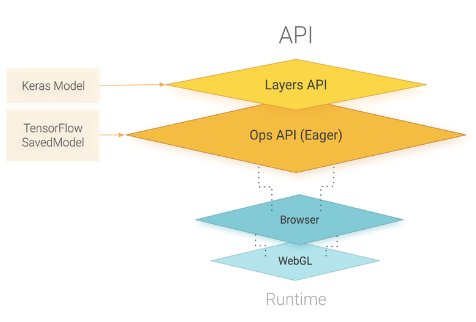

# 14.1 TensorFlow.js 简介

#### 14.1.1 TensorFlow.js能做什么

1、使用JavaScript开发ML：使用灵活直观的API，使用低级JavaScript线性代数库或高级层API从头开始构建和训练模型。

2、使用TensorFlow.js模型转换器在浏览器中或在Node.js下运行预先存在的TensorFlow模型。

3、使用连接到浏览器的传感器数据或其他客户端数据重新制作预先存在的ML模型。

#### 14.1.2 TensorFlow.js AP层级

   TensorFlow.js 主要是由WebGL提供能力支持，并且 TensorFlow.js 提供了一个用于定义模型的高层 API，以及用于线性代数和自动微分的低级 API。

  TensorFlow.js支持导入TensorFlow SavedModels 和 Keras 模型。

