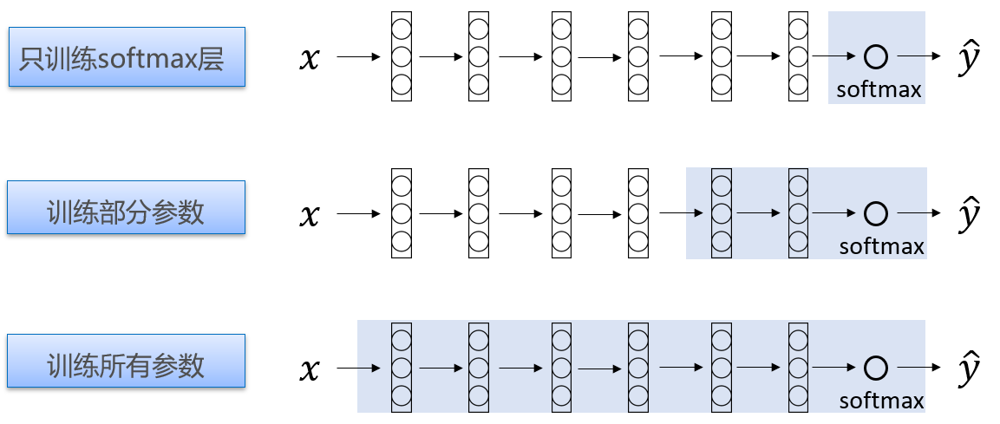

# 10.2 迁移学习简介

迁移学习简单的来说就是使用已经训练好的模型作为新模型的初始化的学习方式，通过重新训练最后几层达到目标。

从之前的学习我们知道，要从头到尾训练一个神经网络，需要大量的数据集、丰富的硬件资源和非常长的训练时间，而迁移学习可以使用较少的样本和更低的训练时间，训练出一个识别率较好的神经网络。比如：网络在Cifar-10数据集上迭代训练5000次收敛，将一个在Cifar-100上训练好的模型迁移至Cifar-10上，只需1000次就能收敛。

当然，迁移学习的应用也是由一定的限制的，要求原来使用较大的数据集训练出来的特征对后来的新数据集有助。当算力有限以及现有的数据集较少时，可以考虑用迁移学习的方法进行模型训练。

