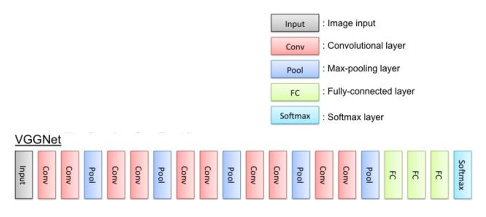

# 10.4 VGG16的Tensorflow实现

#### 10.4.1 VGG-16简介

VGG卷积神经网络是牛津大学2014年提出的模型，这个模型提出后，由于他的简洁性和实用性，马上成为了当时最为流行的卷积神经网络模型。2014年，VGG模型获得了ILSVRC竞赛的第二名，第一名是GoogleNet。VGG-16是深度为16的VGG模型。

#### 10.4.2 定义功能函数

#### 10.4.3 定义VGG-16功能类

