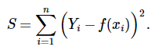
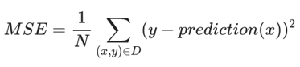

# 4.3 定义损失函数

损失函数（Loss Function）也称为代价函数（Cost Function）是将随机事件或其有关随机变量的取值映射为非负实数以表示该随机事件的“风险”或“损失”的函数。

下面介绍三个比较常见的损失函数。

**4.3.1 L1损失**

L1范数损失函数，也被称为最小绝对值偏差（LAD），最小绝对值误差（LAE）。总的说来，它是把目标值（Yi）与估计值（f\(xi\)）的绝对差值的总和（S）最小化：

**4.3.2 L2损失**

L2范数损失函数，也被称为最小平方误差（LSE）。总的来说，它是把目标值（Yi）与估计值（f\(xi\)）的差值的平方和（S）最小化：

**4.3.3 均方误差 \(MSE\)**

均方误差 \(MSE\) 指的是每个样本的平均平方损失

