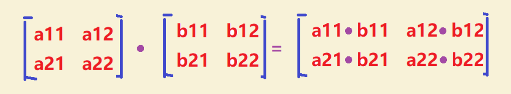
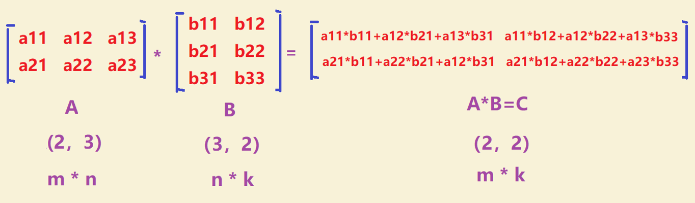
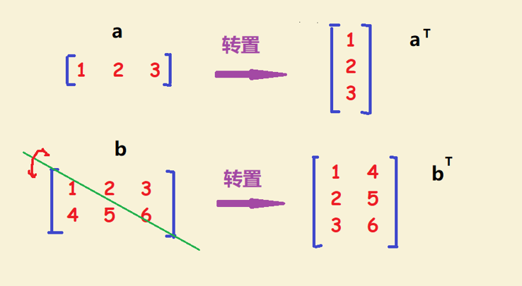

# 5.2 机器学习中的基本线性代数

在开始解决问题之前，我们先对机器学习中的基本线性代数进行简单的介绍。

#### 5.2.1 线性代数的数学对象

标量：标量只是一个单一的数字。

向量：向量是一个有序的数字数组，可以在一行或一列中。

矩阵：矩阵是一个有序的二维数组，它有两个索引。第一个指向该行，第二个指向该列向量也是一个矩阵，但只有一行或一列。

#### 5.2.2 线性代数基本计算规则

如果矩阵乘、除或者加、减一个标量，即对矩阵的每一个元素进行数学运算。

矩阵-矩阵加法和减法要求是矩阵具有相同的尺寸，并且结果将是具有相同尺寸的矩阵。只需在第一个矩阵中添加或减去第二个矩阵的每个值及其对应的值。

矩阵-矩阵点乘要求是矩阵具有相同的尺寸，矩阵各个对应元素相乘。

如果第一个矩阵列的数量与第二个矩阵行数要相等，才能将矩阵相乘。结果矩阵具有与第一个矩阵相同的行数和与第二个矩阵相同的列数。

第一列变成转置矩阵的第一行，第二列变成了矩阵转置的第二行。一个m \* n矩阵被转换成一个n \* m矩阵。

