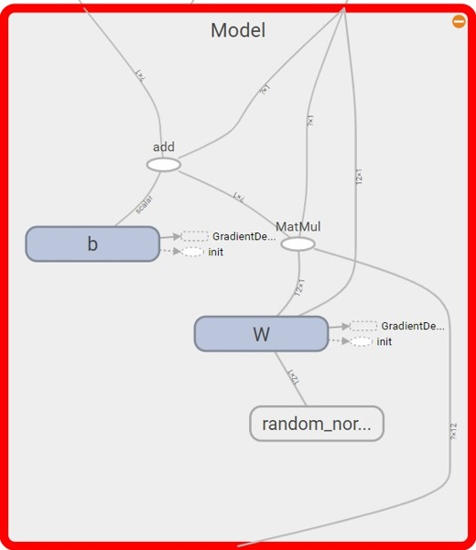

# 5.5 构建模型

#### 5.5.1 定义训练数据占位符

```python
x = tf.placeholder(tf.float32, [None,12], name = "X") # 12个特征数据（12列）
y = tf.placeholder(tf.float32, [None,1], name = "Y") # 1个标签数据（1列）
```

shape中 None 表示行的数量未知，在实际训练时决定一次代入多少行样本，从一个样本的随机SDG到批量SDG都可以。

#### 5.5.2 定义模型结构

```python
# 定义了一个命名空间

with tf.name_scope("Model"):
    
    # w 初始化值为shape=(12,1)的随机数
    w = tf.Variable(tf.random_normal([12,1], stddev=0.01), name="W")
    
    # b 初始化值为 1.0
    b = tf.Variable(1.0, name="b")
    
    # w和x是矩阵相乘，用matmul,不能用mutiply或者*
    def model(x, w, b):
        return tf.matmul(x, w) + b

    # 预测计算操作，前向计算节点
    pred= model(x, w, b)
```

这里我们介绍一下TensorFlow中的命名空间（name\_scope），Tensorflow中常有数以千计节点，在可视化过程中很难一下子全部展示出来，因此可用name\_scope为变量划分范围，在可视化中，这表示在计算图中的一个层级。



