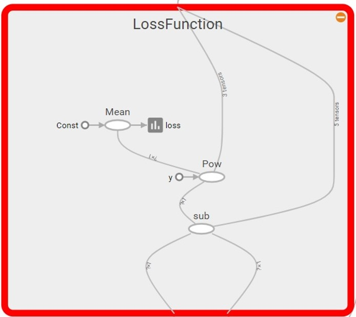

# 5.6 训练模型

#### 5.6.1 设置训练超参数

```python
# 迭代轮次
train_epochs = 50 

# 学习率
learning_rate = 0.01 
```

#### 5.6.2 定义均方差损失函数

```python
# 定义损失函数
with tf.name_scope("LossFunction"):
    loss_function = tf.reduce_mean(tf.pow(y-pred, 2)) #均方误差
```

同样，我们可以通过TensorBoard查看命名空间LossFunction下的操作（op），包括：mean, pow和sub\(相减\)，与我们定义的loss\_function = tf.reduce\_mean\(tf.pow\(y-pred, 2\)\)相一致。



#### 5.6.3 创建优化器

```python
# 创建优化器
optimizer = tf.train.GradientDescentOptimizer(learning_rate).minimize(loss_function)
```

在TensorFlow中我们常用的优化器有：

tf.train.GradientDescentOptimizer                                         tf.train.AdadeltaOptimizer 

tf.train.AdagradOptimizer                                                        tf.train.AdagradDAOptimizer 

tf.train.MomentumOptimizer                                                   tf.train.AdamOptimizer 

tf.train.FtrlOptimizer                                                                  tf.train.ProximalGradientDescentOptimizer

 tf.train.ProximalAdagradOptimizer                                        tf.train.RMSPropOptimizer

#### 5.6.4 初始化变量

```python
sess = tf.Session()
# 定义初始化变量的操作
init = tf.global_variables_initializer()

sess.run(init)
```

#### 5.6.5 迭代训练

```python
for epoch in range (train_epochs):
    loss_sum = 0.0
    for xs, ys in zip(x_data, y_data):   

        xs = xs.reshape(1,12)
        ys = ys.reshape(1,1)

        _, summary_str, loss = sess.run([optimizer,sum_loss_op,loss_function], feed_dict={x: xs, y: ys}) 

        writer.add_summary(summary_str, epoch)
        loss_sum = loss_sum + loss
    
    # 打乱数据顺序，避免过拟合
    xvalues, yvalues = shuffle(x_data, y_data)
    
    b0temp=b.eval(session=sess)
    w0temp=w.eval(session=sess)
    loss_average = loss_sum/len(y_data)
    
    print("epoch=", epoch+1,"loss=", loss_average,"b=", b0temp,"w=", w0temp )
```

