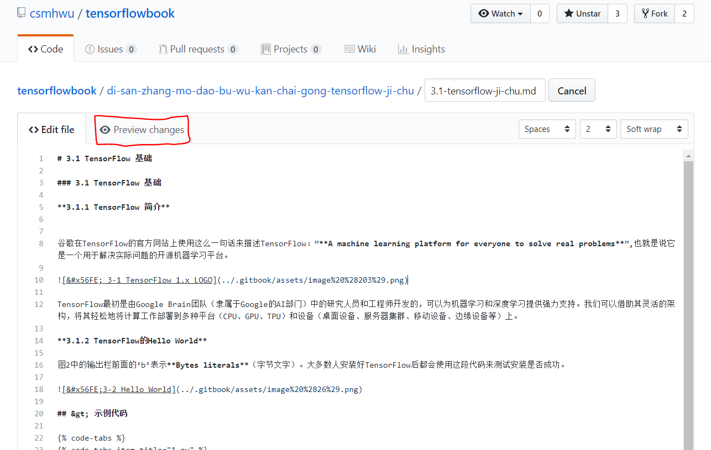
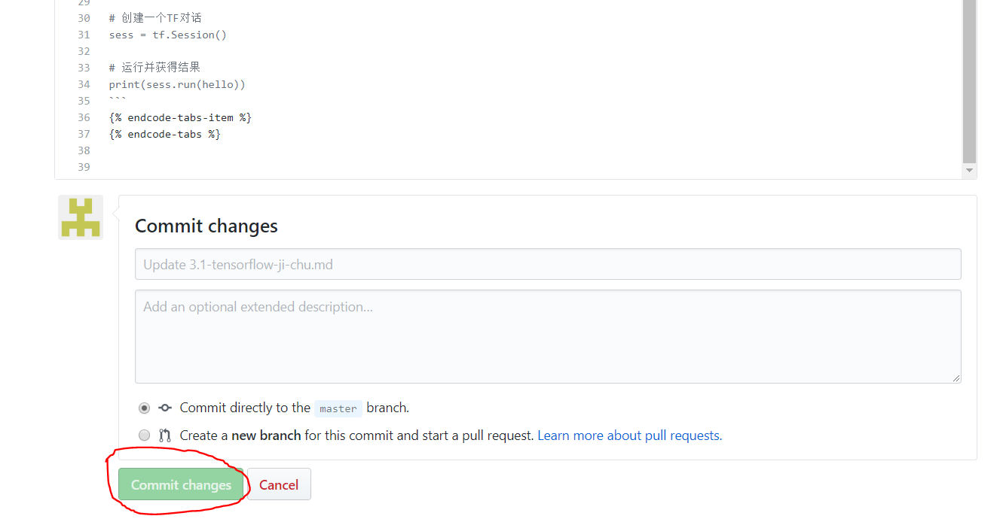

# 附录3 协同编书指南

① 打开Gitbook网址[https://minghuiwu.gitbook.io/tfbook/](https://minghuiwu.gitbook.io/tfbook/)。

②
 浏览目录，找到你想要编辑的章节，这里以第三章为例，点击右上角的“Edit on GitHub”。

③ 在GitHub中打开，点击编辑按钮。

④ 以Markdown的格式进行编辑，更改后可以在“Preview changes”中进行查看。

⑤ 完成编辑，确认无误后，提交更改，等待管理员合并。

