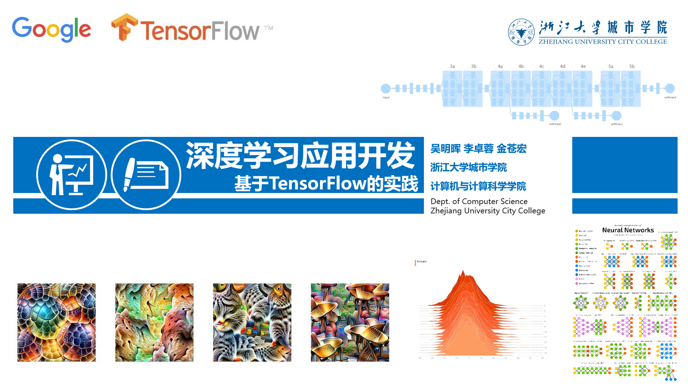

# 前言

## 这是一本基于MOOC课程的众创教材，欢迎大家加入共同创建！

## MOOC课程网址

### [https://mooc.study.163.com/course/2001396000](https://mooc.study.163.com/course/2001396000)

##  课程概述

**一、**     **课程目标**

本课程将全面介绍基于TensorFlow深度学习框架的人工智能应用开发技术。课程不仅会讲解机器学习的基础理论和主流的模型及算法（包括线性回归、神经网络、卷积神经网络、循环神经网络、生成对抗网络等），而且会重点讲解如何基于TensorFlow框架，针对不同的应用场景进行深度学习模型的选择、构建和应用。让学习者能快速具备人工智能问题求解的基本思想和初步的人工智能应用软件开发能力。

**二、**     **课程特点**

不干涩地讲深层次理论和算法，也不是纯粹介绍TensorFlow的编程。而是针对大多数潜在学员的特点（有基本的编程能力，对开发人工智能应用感兴趣，学过一些基本概率统计和线性代数，但谈不上有深厚的数学功底和人工智能理论基础），通过针对典型的人工智能应用场景，设计系列针对性案例来引导学习过程。主要案例包括价格预测、手写数字识别、图像识别、文本情感分析、动画自动上色等，在案例讲解过程中深入浅出地介绍相关理论，并会从中讲解TensorBoard可视化、模型的断点续训等实用技巧。  

本课程将主要内容根据学习阶段分为四部分：筑基篇、启航篇、进阶篇和扩展篇。筑基篇包括人工智能简介、开发环境搭建和Python开发语言快速入门、TensorFlow编程基础等三讲内容；启航篇从单个神经元的线性回归应用开始，直到完成多层神经网络应用开发，共有四讲内容；进阶篇主要围绕深度网络，从卷积神经网络CNN开始，历经循环神经网络RNN、生成对抗网络GAN等应用开发，涵括迁移学习等内容；扩展篇则包括Keras框架、TensorFlow.js、TensorFlow Lite移动应用开发等高级话题。  

